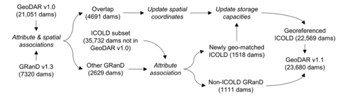
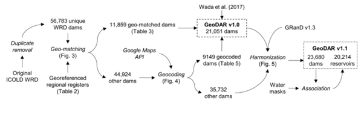
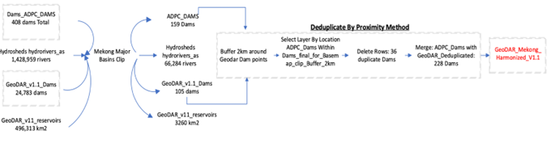
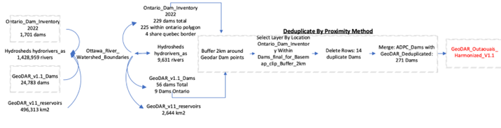
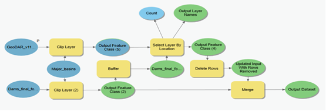
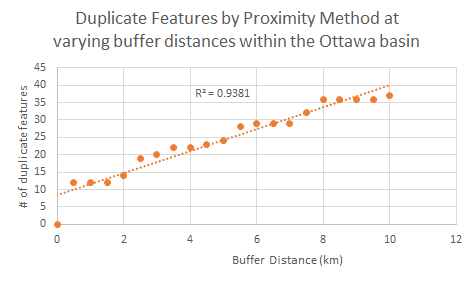
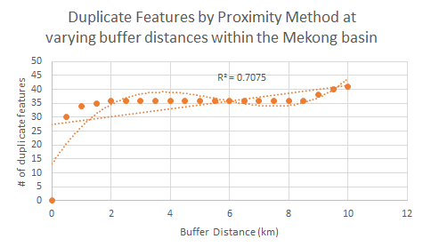
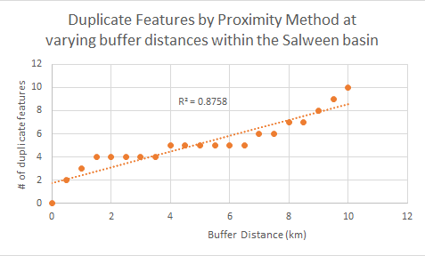

# pyqgisdams

> **DISCLAIMER**: This study is intended for Carleton University’s Geom4005; Undergraduate Directed Study in Geomatics with Dr. Kevin Hamdan, and
in partnership with United Nations University Professor Dr. Charlotte Macalister to provide data innovation for the INWEH project while using the data in geospatial applications to produce a directed study in geomatics. This study is the property of Carleton University and may not be used for business
purposes. The provided GeoDAR v1.1 is proprietary data whose distribution is prohibited and whose accuracy is independent of the study. Datasets such as
HydroSHEDS, Ontario Dam Inventory and subsequent map layers are not produced by the study, and as a result the findings pertain to the geospatial constraints of the datasets. Accurate up to date data may not all be available to the general public.

## Table of Contents

0. [Repository Structure](#repository-structure)
1. [Introduction](#Introduction)
2. [Objectives](#Objectives)
3. [Methodology](#Methodology)
4. [Application](#Application)
5. [Discussion](#Discussion)
6. [Conclusion](#Conclusion)
7. [References](#References)
8. [Appendix A: Maps and Charts](#appendix-a-maps-and-charts)
9. [Appendix B: Data Documentation](#appendix-b-data-documentation)

## Repository Structure
```
pyqgisdams
│   README.md (You are here)    
│
└───img
│   │   Contains all images used within this repository.
└───src
    │   Contains dams_qgis.py for use in QGIS as well the user-guide for the script.
```

## Introduction

Dams and water resources have become a quintessential part of modern society, with an ever-growing reliance on them to support our complex infrastructures. As resources wain and begin to decrease many of the world’s governments and top scientists have collaborated with the objective to better increase dam data on a global scale. Some current efforts include: World Registers of Dams (WRD), GRanD national inventories, GOODD, and ICOLD. From these initial datasets the idea for GeoDAR v1.1 was conceived with the notion of harmonizing global dam data across regions. GeoDAR v1.1’s methodology is demonstrated in Figure 1 and Figure 2 (Wang et al., 2022). The method to harmonize GeoDAR v1.1 is conceived such that an inverse geospatial analysis is tested and verified by updating the Mekong Basin’s regional dataset, then subsequently employed in the Outaouais Basin (Godse, 2022). This repository provides a framework for the semi-autonomous implemetation in Python of the dedeuplication by proximity methodology proposed in:
>Godse, P. (2022). Improving Dam Datasets To Identify Micro-hydro Suitibility: Spatial Data Driven Approach. GEOM4005: Undergraduate Directed Study In Geomatics, Carleton University, student paper.



*Figure 1: GeoDAR V1.1 Geospatial Model figure 6. Adopted from Wang et al., 2022*



*Figure 2: GeoDAR v1.0 and GeoDAR v1.1 figure 5 Georeferenced Model. Adopted from Wang et al., 2022*

Whilst attempting to reduce the number of barriers to access or use this data as current workflows are heavily dependent on paid subscriptions or similar micro-transaction-based services such as ArcGIS Pro, which requires a license for concurrent use. Thus, gatekeeping the tools required, which can decrease the number of people that can interact with and disseminate the data on their own, further limiting the effectiveness of open-source citizen-science outreach. Current de-clustering methods rely on a manually observed 2km proximity-based approach, which although effective in the tested regions of the Mekong and Outaouais Basin’s, raises the conceptual question of: ‘is buffering by this specific amount unintentionally introducing errors?’.

## Objectives

The primary objective of this directed study is to adapt the current semi-automated model-based approach to an automated open-sourced script that can be run from the command line or QGIS. The current ArcPro model-builder illustation can be seen in Figure 5. Additionally, by providing a script as a deliverable, it will become easier to disseminate upon completion, via the establishment of an openly accessible repository on GitHub or a similar service. The goal is to produce a publicly available, easily accessible script that can be ran from QGIS or the CLI and stored within a GitHub repository (Repositories, n.d.) or similar.



*Figure 3: Diagram for harmonization of dam datasets using deduplication by proximity. Adopted from Godse, P. (2022)*



*Figure 4: Diagram for harmonization of dam datasets using deduplication by proximity. Adopted from Godse, P. (2022)*



*Figure 5: ArcGIS Pro Model Builder for GeoDAR v1.1. Adopted from Godse, P. (2022)*

## Methodology

The brunt of this project was to convert the current semi-automated model-builder approach to a scriptable format for easier automation capabilities, future scalability, and quality of life upgrades regarding minimizing GUI interaction. The model-based logic and geo-processing tools used previously in ArcGIS Pro will be converted using the QGIS toolset. A script will be uploaded and shared publicly once completed, with appropriate documentation, so that anyone who wishes to explore it for themselves, can do so; thereby increasing the potential for citizen scientists to record their own dam data. Once adapted, accuracy will first look to be replicated in the original region of study by cross comparing methods of replicant removal and overall region accuracy, before attempting to expand further and possibly improve accuracy by applying the automated approach to a new study area/catchment. This method ensures that an adequate level of open-source outreach and accessibility is still achieved, whilst still allowing for the potential improvement of accuracy to pre-existing methods if a more accurate technique is encountered during the duration of the study.

## Application

The harmonization process begins with qsetting the script inputs and outputs to match the region your working in. For the Mekong basin the shapefile for the basin is set, same for the dams (GeoDAR and ADCP), and lastly the HydroRivers shapefile path is set. Next, the layers are reprojeced to their local UTM zone to reduce error from datums, acrucial step not covered in the Model Builder approach. Next using the clip layer tool against all the aforementioned input data the processing begins. Full diagrams of the Mekong and Outaouais workflows can be seen in Figures 3 and 4. From this first step, 159 ADPC dams, 105 GeoDAR dams, 3260 km2 of reservoir and 66284 hydro river polylines are within the region. Due to the impedance geo-referencing in GeoDAR, a proximal analysis is performed.

The second step is to visualize the data in QGIS and to view whether there is an abundance of duplicates, such that 36 GeoDAR dams are duplicates. Notably, there appears to be unique and unaccounted dams within both datasets, which are accounted for in harmonization. To deduplicate, GeoDAR dams are selected within a 2km buffer of ADPC dams. The buffer distance is selected as a manual, region specific filter based on manual observation. The buffer is derived by automatically verifying and testing 0.0km-10.0km buffers at increasing increments of 0.5km where the number of duplicates increased only from 0.5km and 1.0 km buffer but did not change from 2.0 km to as large as 10 km thus, 2km was selected as an acceptable range for the study. As a result of merging both dam datasets, 228 unique dams are now accounted within the region.

When merging the two files it’s crucial to pay attention to the right merge relationship to avoid compiling encoded or interpolated data and to include the most useful attributes. This is done using a native vector merge via list, containing only the GeoDAR and regionally specfic dams, using GeoDAR as the row to merge against due to it having a higher count of seeable fixtures whereas the regional data usually does not. Once the geo-processing has finished the updated dedeuplcated layer is added to the QGIS contents pane, and a prompt is displayed letting you know the count of duplicate features within a n-th km buffer, as well as total runtime.

## Discussion

Initially, the hypothesis for this study involved iteratively testing different buffering proxies to harmonize the dataset based on varying distances to ascertian if they were introducing uneeded error. However, it became obvious rather quickly that by applying varying buffering proximities at increments of 0.5 km on each iteration, that the optimal buffering proxy is 2km. This is further supported by the strong positive correaltion in the Outaouais basin, shown in Figure 6, as well as the strong R<sup>2</sup> value of 0.9381, meaning that almost 90% of the observed variation can be explained by the model input; at least within the Outaouais basin. When applying the previously mentioned iterative buffering in the Mekong basin a much less linear realtionship is apperant. Although the R<sup>2</sup> value of 0.7075 can be said to explain some of the observed variance within the data, it does not show nearly of as strong of a correlation as within the Outaouais basin. This is likely due to the fact the original 2km buffer was chosen after real world obsevation around the Ottwa area. The Mekong basin displays characteristics that are best matched by a polynomial trendline, specfically that of a cubic function, as can be seen in Figure 7.

To fully confirm if a more regionally optimal number exists within the Mekong basin further iterative testing was compelted in the contiguous Salween basin, as can be seen in the map of Figure 12. From testing with the same iterative parameters used in the previous two basin areas, it can be seen that the a rather strong linear realtionship, as demonstrated by the R<sup>2</sup> value of 0.8758, meaning that almost 88% of the observed variation can be explained by the model input the required within the basin region. Additionally, looking to the charts showin in Figures 6,7, and 14 it can assertained that as the buffering distance increases, for the most part the number of duplicate features also increases, however that doesn't meant the ever increasing duplicate counts are not a result of random noise or error. Hence, why the 2km buffer is a strategically optmial distance choice, due to its ability to limit overfitting, by not having an excessively large buffer that supersedes the regional basin buffer, while at the same time being large enough that it actually allows for some distance between structures, as it is unlikely for them to be in proximities of 1km or smaller.

## Conclusion

For this project the harmonization between two regionally independent datasets, in conjunction with GeoDAR v1.1 was completed; in the Mekong Basin and the Outaouais Basin, whilst the subsequent analysis of the manually observed distance of the latter two allowed for confirmation that the distance of 2km is not causing unneeded error. Utilizing the deduplication by proximity methodology and supporting script, GeoDARs dam counts were consequently improved from 105 to 159 points in the Mekong Basin and 56 to 271 within the Outaouais Basin. By applying varying buffering proximities at increments of 0.5 km on each iteration via the QGIS script, it can be confirmed that the optimal buffering distance without introducing more unwanted errors is 2km or 2000m, this  can be seen in the corresponding plots for both the Outaouais and Mekong basom in Figures 6,7. There seems to be a linear relationship between the increasing buffering proxies and duplicate features within the Outaouais basin, as can be visually seen on the plot in Figure 6 as well as the supported by the R<sup>2</sup> value of 0.9381. Whereas in the Mekong basin, any attempts to model it linearly are inaccurate in comparison. Well the R2 value of 0.7075 can be said to explain some of the variance within the data, it does not show nearly of as strong of a correlation and this is likely due to the fact the original 2km buffer was chosen after real world obsevation around the Ottwa area as opposed to the Mekong. Within the newly tested Salween basin, there is also what appears to be a linear relationship between the increasing buffering proxies and duplicate features, similar to the Outaouais basin, as can be visually seen on the plot in Figure 14, in addtion to the fairly high R<sup>2</sup> value of 0.8758. However, more testing is required to confirm if a slightly more optimal buffer can be computed, one improvement for the future could be to test a range of varying increments (0.25,0.75, etc. ) to increase or decrease by to see if this has addtional impact.



*Figure 6: Showing buffering proximities at increasing increments of 0.5km within the Outaouais Basin*



*Figure 7: Showing buffering proximities at increasing increments of 0.5km within the Mekong Basin*



*Figure 14: Showing buffering proximities at increasing increments of 0.5km within the Salween Basin*

## References

> J. Wang, B. A. Walter, F. Yao, C. Song, M. Ding, A. S. Maroof, J. Zhu, C. Fan, J. M. McAlister, M. S. Sikder, Y. Sheng, G. H. Allen, J.-F. Crétaux, and Y. Wada, “Geodar: Georeferenced global dams and reservoirs dataset for bridging attributes and geolocations,” Zenodo [Online]. Available: https://zenodo.org/record/6163413#.YsUIJezMIjg. [Accessed: 12-Sept-2022].

>Godse, P. (2022). Improving Dam Datasets To Identify Micro-hydro Suitibility: Spatial Data Driven Approach. GEOM4005: Undergraduate Directed Study In Geomatics, Carleton University, student paper.

>Flater, D. Understanding Geodesic Buffering. (n.d.). Available: https://www.esri.com/news/arcuser/0111/geodesic.html. [Accessed 18-Oct-2022].

>tanawatl. (2016, February 3). For which real world data sets does DBSCAN surpass K-means.? [Forum post]. Data Science Stack
Exchange. Available: https://datascience.stackexchange.com/q/10063. [Accessed: 25-Sept-2022].

>Repositories. (n.d.). GitHub Docs. Available: https://ghdocs-prod.azurewebsites.net/en/repositories. [Accessed: 25-Sept-2022].

>Ester, M., Kriegel, H.-P., & Xu, X. (n.d.). A Density-Based Algorithm for Discovering Clusters in Large Spatial Databases with Noise. 6. AAAI [Online]. Available: https://www.aaai.org/Papers/KDD/1996/KDD96-037.pdf. [Accessed: 15-Sept-2022].

>Ashour, W., & Fyfe, C. (2007). Inverse Weighted Clustering Algorithm. ResearchGate [Online]. Available: https://www.researchgate.net/publication/255646203_Inverse_Weighted_Clustering_Algorithm. [Accessed: 15-Sept-2022].

>davidtraynor. (2019, April 9). Answer to “Is there an opposite to Clustering or ’Anti-’Clustering?” Cross Validated. Available: https://stats.stackexchange.com/a/402131. [Accessed: 15-Sept-2022].

>Deutsch, C. (2015, October 5). Cell Declustering Parameter Selection. Available: https://geostatisticslessons.com/lessons/celldeclustering. [Accessed: 28-Sept-2022].

## Appendix A: Maps and Charts

**Figure 1:**


**Figure 2:**


**Figure 3:**


**Figure 4:**


**Figure 5:**


**Figure 6:**


**Figure 7:**


**Figure 8:**


**Figure 9:**


**Figure 10:**


**Figure 11:**


**Figure 12:**


**Figure 13:**


**Figure 14:**


## Appendix B: Data Documentation

>Wang, J., Walter, B. A., Yao, F., Song, C., Ding, M., Maroof, A. S., Zhu, J., Fan, C., McAlister, J. M., Sikder, M. S., Sheng, Y., Allen, G. H., Crétaux, J.-F., & Wada, Y. (2022). GeoDAR: Georeferenced global Dams And Reservoirs dataset for bridging attributes and geolocations [Data set]. Zenodo. https://doi.org/10.5281/zenodo.6163413

>HydroBASINS. (n.d.). Retrieved September 25, 2022, from https://www.hydrosheds.org/products/hydrobasins
  
>HydroRIVERS. (n.d.). Retrieved September 25, 2022, from https://www.hydrosheds.org/products/hydrorivers

>Ontario Dam Inventory. (n.d.). Retrieved September 25, 2022, from https://geohub.lio.gov.on.ca/maps/mnrf::ontario-dam-inventory

>Open Ottawa. (n.d.). Retrieved September 25, 2022, from https://open.ottawa.ca/

>RVCA GIS Maps. (n.d.). Retrieved September 25, 2022, from https://gis.rvca.ca/

  

  


  

